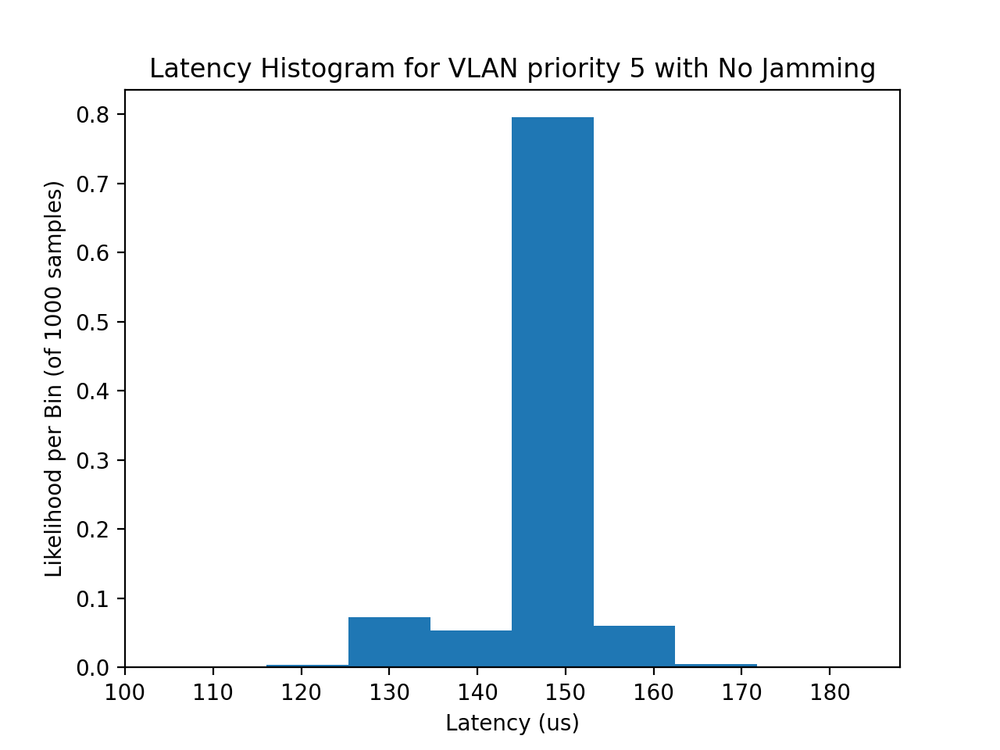

# Latency Processing for TSN Traffic Logs

The output of the parent folder's *sink* executables is a CSV file containing latency values between the source and sink.

The Python script in this directory will produce histograms of the latency for each test within the CSV. It will also produce a chart with latencies (with error bars) and packet drop rates on a per-priority basis, although the user must inform whether the CSV was generated when a jammer was present or not.

## Dependencies

Python3 with the following packages:

* Numpy
* Pandas
* Matplotlib

## Sample Outputs from CMU Network

VLAN with priority 5 (above best efforts) with and without a jammer when using Raw sockets:

Statistics from Raw Sockets trials:

