# TSN Switch Setup

These instructions are for configuring a Belden BOBCAT BRS40 managed layer 2 switch. The switch is TSN compatible, in that it implements several of the standards at the core of TSN.

These instructions will cover the GUI-based configuration. Every page in the GUI includes a help icon to explain what each element of the interface does (although some descriptions are too succinct). Note that the interface will log you out after 5 minutes of inactivity.

If there are multiple switches, they should be configured identically, aside from port-specific configurations (which should either be applied to all ports or on a case-by-case basis per your application requirements).

## Contents

* [Guides/Documents from Belden/Hirschmann](#guides-and-documents-from-belden-and-hirschmann)
* [Setup](#switch-setup)
* [Time Sync](#time-sync)
* [VLAN Configuration](#vlan-configuration)
* [TSN TDMA-style QoS](#tsn-functions)


## Guides and Documents from Belden and Hirschmann

[Hirschmann BOBCAT BRS User Manual](https://www.doc.hirschmann.com/pdf/IG_BRS20304050_02_1118_en_2018-11-15.pdf)
[Switch Operating System Version 8.X](https://catalog.belden.com/index.cfm?event=pd&p=PF_HiOS8BOBCAT)
[Hirschmann BOBCAT BRS40 Documents](https://catalog.belden.com/index.cfm?event=config&p=BRS40-8TX-EEC&c=Config215832)


## Switch Setup

### Hardware Setup

Before anything else, the switch must be powered on. It takes a 12-24 V power supply, which should be provided as two wires to the screw-down recepticle near the top of the front panel. Ideally, two power supplies will be provided for redundancy, but the switch will still operate with one power supply (despite its warnings).

The image below shows the switch plugged into 3 NUC mini-PC endpoints (ports 2, 4, and 8) and a local router (port 7). The power supply is rigged to expose power and ground (white and black wires, resp.) for plugin to the terminals as shown.

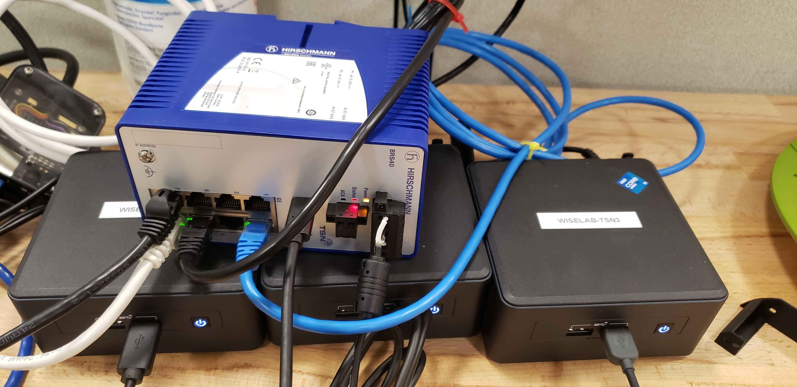

Note that there is also a USB-C to USB-A cable connecting the switch to one of the NUCs. This cable is located between the status lights and the Ethernet ports, and is used for initial configuration before the switch is assigned an IP address

### Software Setup

The initial setup process involves logging into the switch using the default username (```admin```) and password (```private```), which must immediately be changed. This should be done from the Linux device with a USB connection to the switch.

Once logged in, you should see an interface like the one below:

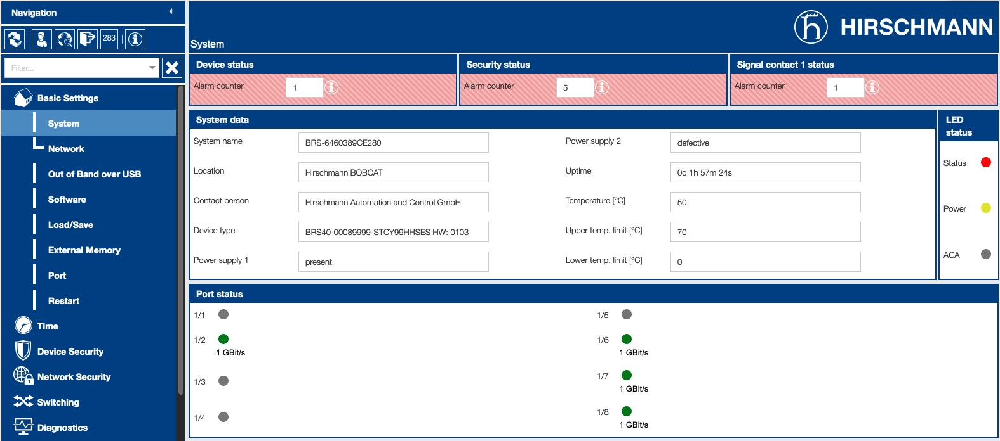

This shows basic information like power-supply status (missing supplies will show as defective), a device name, uptime, port status, etc.

The settings are categorized hierarchically along the left side of the interface. Navigate to *Basic Settings -> Software* to view the current version of the operating system, HiOS. It should be at least 8.7; earlier versions may not have TSN features. Software may be updated by dragging the binary into the "Software update" box in the middle of this screen. See an image of this interface below:

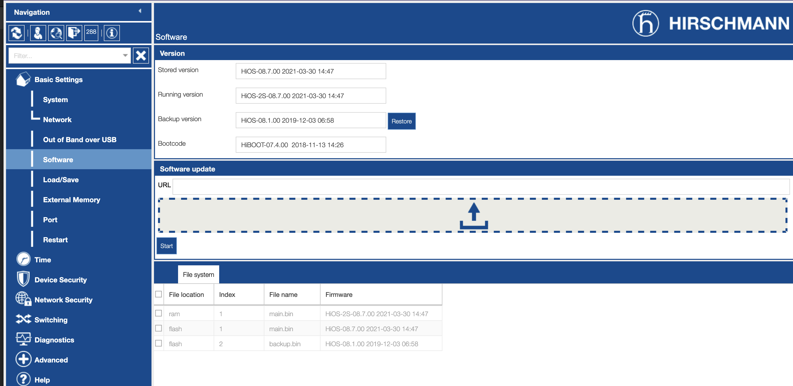

The switch will use a configuration loaded into memory, which it will read from NVM by default. The configuration stored in NVM is not necessarily the same as what it is currently running. The two can be synchronized from the *Basic Settings -> Load/Save* menu as shown below. If NVM and the running configuration are in sync, a box in the upper right will be checked. To save the current configuration, use the save/floppy disk icon at the bottom of the screen (not shown).

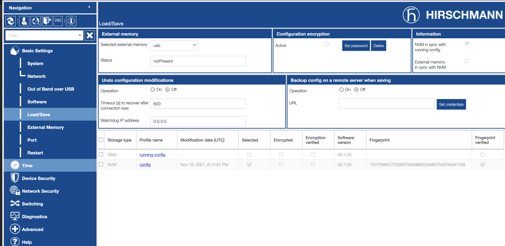

#### DHCP

While not inherently required, it is recommended to setup DHCP, else the user will need to assign IP addresses to MAC addresses within the LAN. This may be configured under *Basic Settings -> Network -> IPv4* (there is a similar interface for IPv6). In our network, a DHCP server is located at 192.168.1.1, and was immediately recognized by the switch; some LANs may require more elbow grease to detect the DHCP server. The image below shows this setting in our sample network.

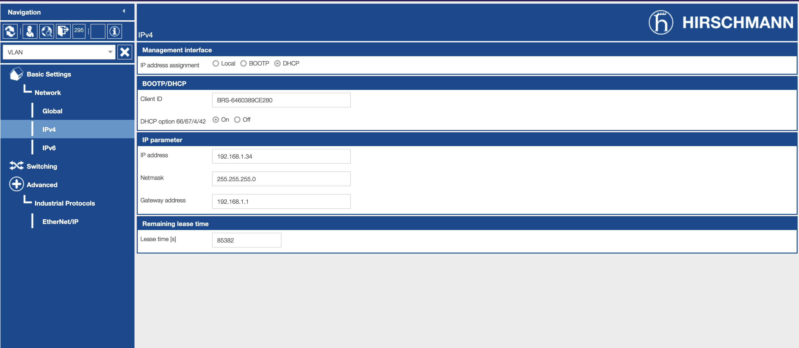

## Time Synchronizatino

The switch may synchronize its clock and propagate timing information to connected devices via Simple Network Time Protocol (SNTP), Precision Time Protocol (PTP) or 802.1AS (aka, generic PTP or gPTP). Configuration settings are availabile under the "Time" heading in the sidebar. If the switch is running an old OS version, the PTP and 802.1AS options may not appear.

The image below shows the switch's interface for 802.1AS/gPTP, which we use in our system.

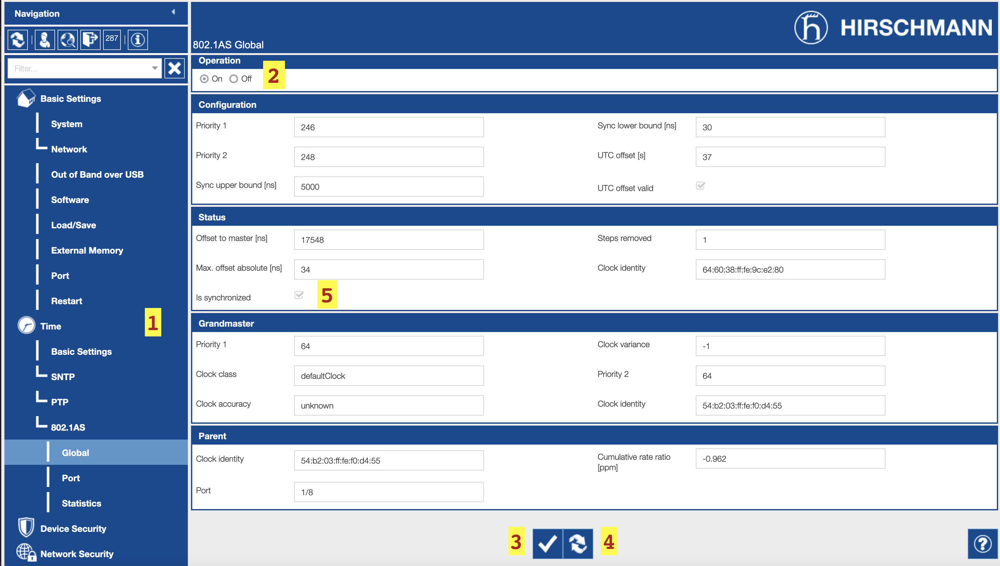

See also the [readme](./ptp/gptp/README.md) in the PTP directories. The default settings here will suffice.

You may also view synchronization parameters and statistics for devices connected at each port in the *Time -> 802.1AS -> Port* and *Time -> 802.1AS -> Statistics* menus. The image below shows the former interface, in which we can see this switch is acting as the slave to a clock at port 8 and a master to clocks at ports 2 and 6.

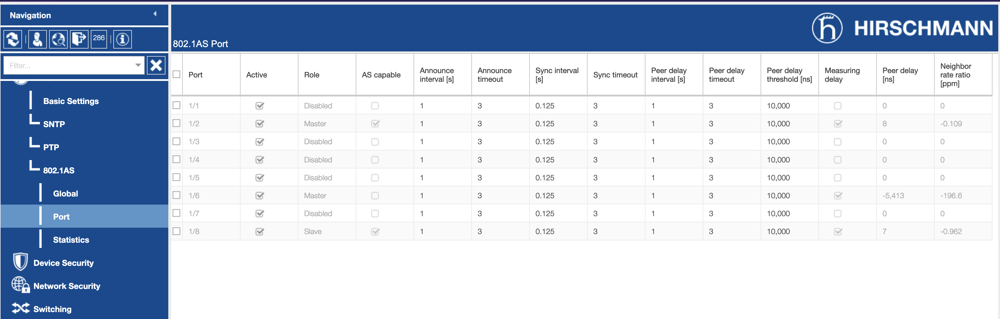

Port 6 appears to be poorly synchronized based on the reported Peer delay and Neighbor clock rate ratio -- this interface is useful for displaying anamolies.

## VLAN Configuration

VLANs are central to TSN, as almost every standard under the TSN umbrella is an amendment on the VLAN standards, 802.1Q

The bulk of VLAN configuration happens on the endpoint devices per the [instructions](VLAN_setup.md) in this repo.

VLANs may be configured under *Switching -> VLAN*, but some VLAN settings are in other sections within *Switching*. The image below shows the VLANs configured per the other instructions. 

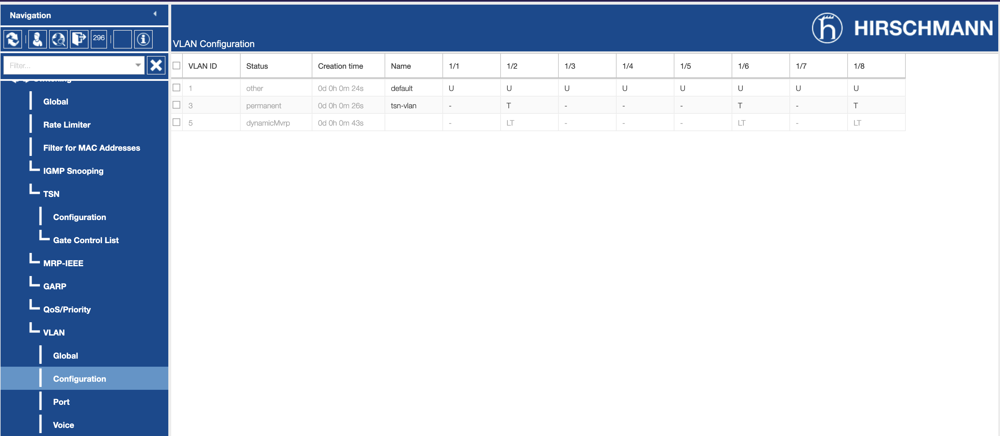

We see VLAN 3 will be used to send tagged (T) frames from ports 2, 6, and 8. We also see VLAN 5 will be used to send tagged frames from ports 2, 6, and 8; this VLAN was learned using MVRP, which we will setup next. VLAN 1 is always present and is meant for sending management messages between nodes.

### MVRP

Multiple VLAN Registration Protocol (VLAN) is an IEEE protocol based on MRP for configuring and propagating VLAN information. All this requires is flicking the switch from off to on in the *Switching -> MRP-IEEE -> MVRP* page, as shown below.

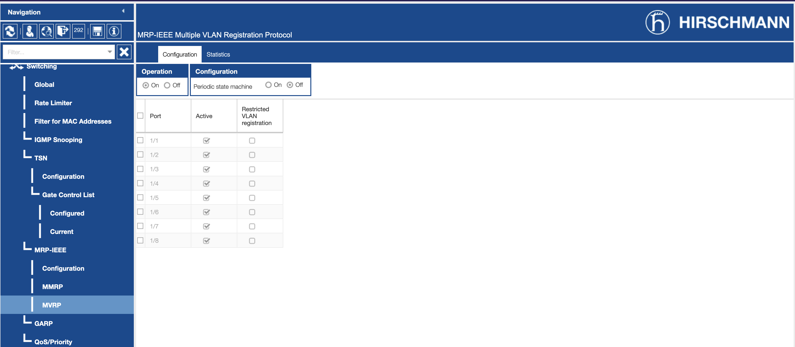

When [VLANs are configured with MVRP on](VLAN_setup.md#setting-mvrp) in the endpoints, their membership to the VLAN will be automatically sent to the switch.

**NB**: it is unclear if this will be propagated among multiple switches. The experiments and configurations to date have only been testing on a single switch.

### VLAN Priority and Traffic Class

The main knob for QoS in this switch is the priority on the 802.1Q ethernet frame.

At the level of the endpoints, the priority comes from an ["egress-qos-mapping"](VLAN_setup.md#setting-egress-traffic-mapping) that relates a traffic class (or socket priority) to a VLAN priority between 0 and 7. There is a similar mapping in the switch between teh VLAN priority and the switch's notion of 'traffic class'. The priority in the VLAN frame will not be modified, but it will be enqueued and serviced based on the mapping in *Switching -> QoS/Priority -> 802.1D/p Mapping*.

It is not required to change this; it is preferred to handle this in the endpoint itself, although it is worth seeing that priorities 0-2 do not have a 1-to-1 mapping (3-7 do).

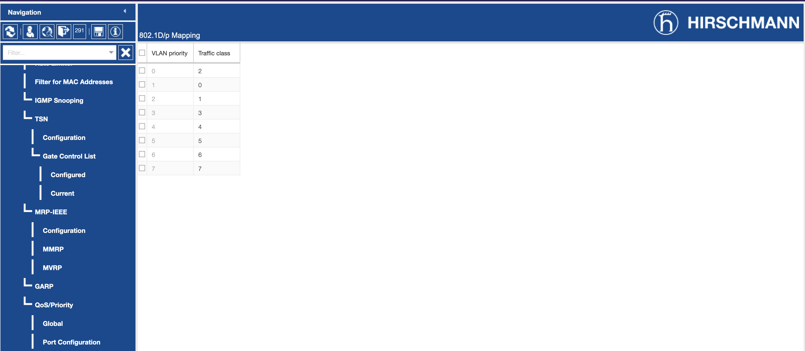

## TSN Functions

TSN functions and configurations are located in *Switching -> TSN*. As of HiOS version 8.7, this only includes TDMA-style traffic shaping.

Note that TSN functions will not work unless the switch is synchronized with PTP or 802.1AS. If it is not synchronized, it is not possible to turn on TSN functions at the top of the top-level TSN configuration page. This page is shown below:

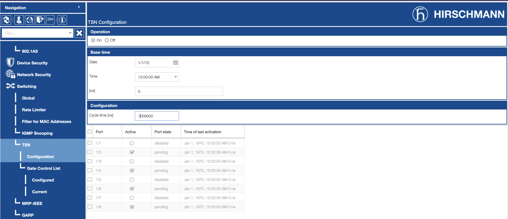

If the device at a port is not synchronized, it will be shown as 'pending', like in the image.

TDMA style traffic shaping is handled on a per-port basis, configured under *Switching -> TSN -> Gate Control List -> Configured*. There is a global cycle time in the main Configuration page (default of 1ms). Each port's "Gate Control List" is a set of time slots, relative to the global cycle, that will send frames from 0 or more [traffic classes](#vlan-priority-and-traffic-class). An example is shown in the image below:

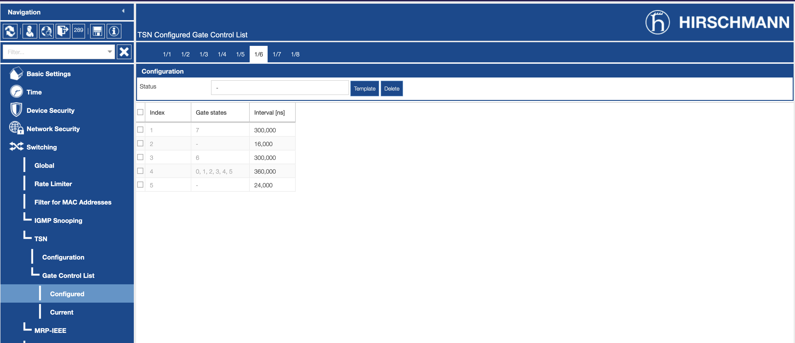

The 'gate states' is a set of nonexclusive traffic classes that are allowed to send frames during this time interval. Each interval follows the previous one; it is recommended to include a guard band (empty gate state) of at least 8000 ns between each gate state that is non-empty.

One limitation of this interface is that it does not allow arbitrary configurations; they must be based on one of two templates with 2 or 3 slots of data to be sent. A new template can be made with the CLI interface if more slots are needed. Hopefully this will be resolved in future versions of HiOS (along with more TSN functions like stream reservation).
